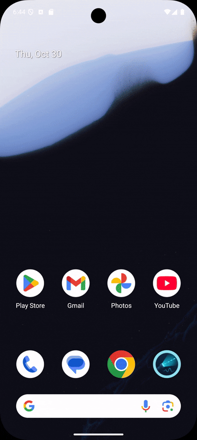
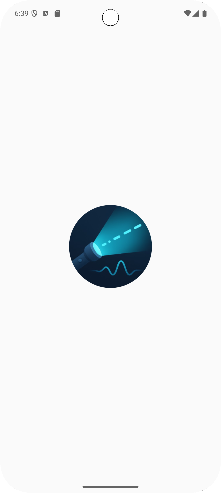
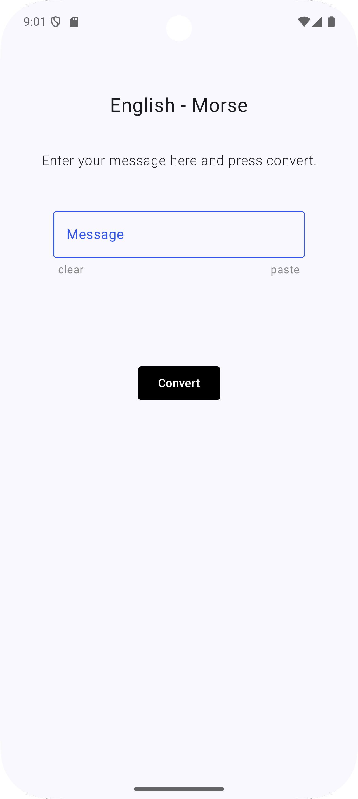
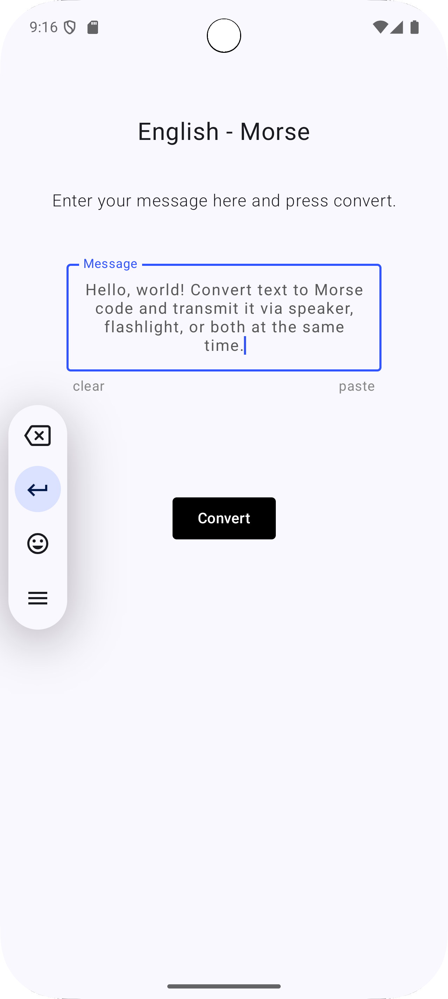
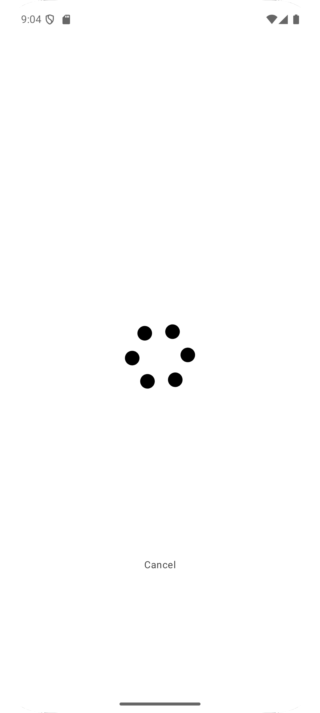
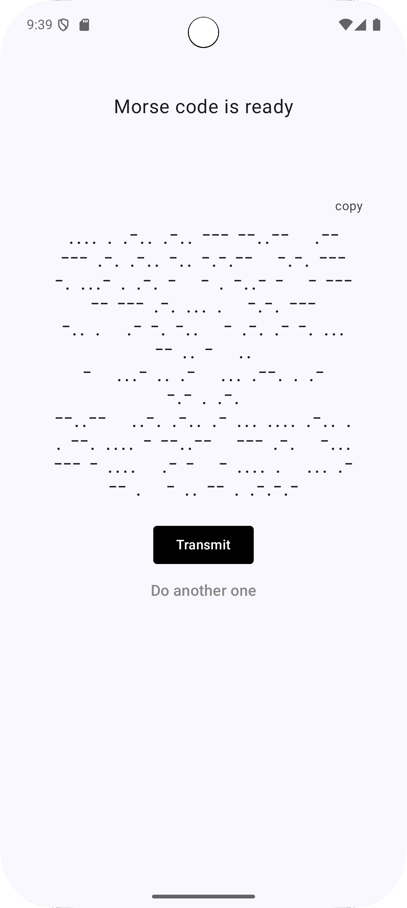
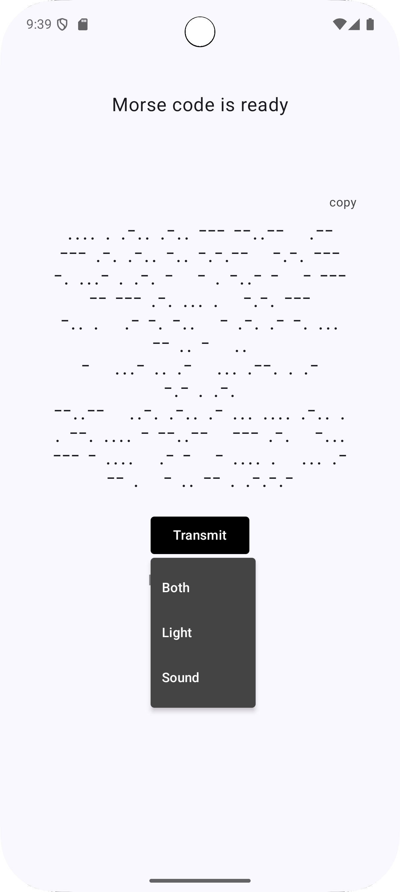

# Morse Link

A simple app that can convert your string text message into Morse code and transmit it using your phone's speaker and flash-light.

## Previews

## Screenshots

     

## About the app
#### This app will need CAMERA PERMISSION to work properly.

- This app is 100% offline (no internet connection needed!)
- Flashlight is accessed using the deprecated camera API.
- so this app supports a wide range of mobile devices starting from API level 21.
- you can pause, resume or cancel the transmission midway.
- maintened a modern and minimalist UI through out the app.
